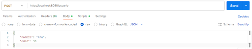

[⌂ Volver al inicio](index.md)

## Índice

1. [Entorno de trabajo](#1-entorno-de-trabajo)
   - [1.1. Java - JDK](#11-java---jdk)
   - [1.2. IntelliJ IDEA](#12-intellij-idea)
   - [1.3. Postman](#13-postman)
2. [Spring Boot](#2-spring)
   - [2.1. ¿Qué es?](#21-qué-es-spring-boot)
   - [2.2. Ventajas](#ventajas-de-usar-spring-boot)
    - [2.3. Primer proyecto](#23-primer-proyecto)
3. [Anatomía de una Aplicación Spring Boot](#3-anatomía-de-una-aplicación-spring-boot)
   - [3.1. Ficheros Importantes en un Proyecto Spring Boot](#31-ficheros-importantes)
   - [3.2. Clase principal](#32-clase-principal)
   - [3.3. Archivo application.properties](#33-archivo-applicationproperties)
4. [Web estática vs web dinámica](#4-web-estática-vs-web-dinámica)
   - [4.1. Página web estática](#41-página-web-estática)
   - [4.2. Página web dinámica](#42-página-web-dinámica)
5. [Creación de páginas web con Spring Boot](#5-creación-de-páginas-web-con-spring-boot)
   - [5.1. Anotaciones más comunes](#51-anotaciones-más-comunes)
   - [5.2. Estructura típica por capas](#52-estructura-típica-por-capas)
   - [5.3. Carpeta resources](#53-carpeta-resources)
6. [Creación de Páginas Web Estáticas en Spring Boot](#6-creación-de-páginas-web-estáticas-en-spring-boot)
7. [Creación de Páginas Web Dinámicas en Spring Boot](#7-creación-de-páginas-web-dinámicas-en-spring-boot)
   - [7.1. Introducción a controladores](#71-introducción-a-controladores)
8. [Métodos HTTP en Spring Boot](#8-métodos-http-en-spring-boot)
   - [8.1. Método GET](#81-método-get)
   - [8.2. Método POST](#82-método-post)
9. [JSON](#9-json)
10. [Actividades](#actividades)

## 1. Entorno de trabajo

### Instalaciones necesarias

- **Java JDK:** Descarga e instala la última versión (nosotros utilizaremos Java 21).
- Verifica con: `java -version`
- **IntelliJ IDEA:** Ultimate tiene mejor soporte para Spring, pero con Community también se puede.
- **Postman:** Para probar tus endpoints REST.
- **Base de datos:** MySQL, PostgreSQL o la que prefieras. También puedes empezar con H2 (en memoria).

### 1.1. Java - JDK

<https://www.oracle.com/java/technologies/downloads/>

```text
C:\Users\2DAM>java -version
java version "21.0.8" 2025-07-15 LTS
Java(TM) SE Runtime Environment (build 21.0.8+12-LTS-250)
Java HotSpot(TM) 64-Bit Server VM (build 21.0.8+12-LTS-250, mixed mode, sharing)
```

### 1.2. IntelliJ IDEA

<https://www.jetbrains.com/idea/download/?section=windows>

### 1.3. Postman

Se puede descargar o usar la versión online.

<https://www.postman.com/downloads/>

## 2. Spring


Spring es un framework de Java muy popular que facilita el desarrollo de aplicaciones empresariales. Permite construir aplicaciones más modulares, fáciles de probar y mantener.

### Características

- Spring se encarga de crear y gestionar los objetos (beans) en lugar de que tú los instancies manualmente.
- Programación orientada a aspectos, separar preocupaciones transversales.
- Spring MVC.
- Integración.

### 2.1. ¿Qué es Spring Boot?


Spring Boot es un framework basado en Spring que simplifica la creación de aplicaciones Java al proporcionar configuraciones automáticas y convenciones preestablecidas.

Permite desarrollar aplicaciones independientes y listas para producción con **mínima configuración**.

#### Ventajas de Usar Spring Boot

- **Configuración Automática (Auto-Configuration):** Spring Boot configura automáticamente los componentes según las dependencias presentes en el proyecto.
- **Servidor Embebido:** Incluye servidores como Tomcat, Jetty o Undertow, lo que permite ejecutar la aplicación sin necesidad de desplegarla en un servidor externo.
- **Inicio Rápido de Proyectos:** Con herramientas como Spring Initializr, se pueden generar proyectos base en cuestión de minutos.
- **Actuadores (Actuators):** Proporciona endpoints para monitoreo y gestión de la aplicación.
- **Mínima Configuración XML:** Se enfoca en convenciones y anotaciones, reduciendo la necesidad de archivos XML de configuración.

### 2.3. Primer proyecto

#### Spring initializr


- Genera un esqueleto de proyecto para importar.
- Accede a: <https://start.spring.io/>
- Elige gradle o maven. Depende de las dependencias y el archivo de configuración. Nosotros vamos a trabajar con maven.
  - gradle → `build.gradle`
  - maven → `pom.xml`
- Lenguaje de programación: Java.
- Versión de Spring Boot → Trabajar con la última disponible (viene por defecto, no SNAPSHOT ni M, ya que están en desarrollo).

Configuramos los metadatos:

- **Group:** dominio de la empresa o ejercicio (al revés `com.dominio`).
- **Artifact:** nombre con el que se va a identificar por ejemplo para importar (sin espacios).
- **Nombre del proyecto.**
- **Descripción.**
- **Nombre del paquete:** dónde se guardará la estructura de carpetas del proyecto.
- **Packaging:**
  - **jar** (java archive): contiene servidor y aplicación sin necesidad de servidor externo.
  - **war** (web application archive): para crear una aplicación web, se tienen que desplegar en un servidor web externo como Tomcat. Nosotros usaremos esta opción.
- **Java**, la versión LTS que tengamos instalada → 21 en nuestro caso.

**Dependencias:** componentes o bibliotecas que la aplicación necesita para funcionar.

- **Spring Web:** para usar apis RESTFUL y genera servidor tomcat → Añadir siempre.
- **Spring Data JPA:** Para interactuar con bases de datos utilizando JPA.
- **Spring Security:** Para añadir seguridad a la aplicación.
- **Thymeleaf:** Para generar vistas HTML desde el backend.
- **H2 Database:** Base de datos en memoria para pruebas rápidas.

**Generar** → se genera un archivo comprimido con el nombre que hemos puesto en Artifact listo para importar en nuestro IDE.

#### Práctica

Crea un proyecto de ejemplo siguiendo las indicaciones dadas en los apartados anteriores, puedes ayudarte del vídeo adjunto.

De momento no tienes que realizar ninguna entrega solo crear el proyecto con Spring Initializr.

#### Trabajar con el proyecto

- Descomprimir el proyecto generado.
- Abrir IntelliJ y seleccionar Open para abrirlo. Cuidado, no abrir ninguna carpeta dentro del proyecto sino la carpeta principal, la que tiene el nombre que pusimos en los metadatos en Artifact.
- Esperamos a que cargue las dependencias. Aceptar los mensajes que salgan en la esquina inferior derecha.
- **pom.xml** → Archivo de configuración con información, dependencias etc…
- **src:** alberga toda la lógica del proyecto. Si da error al importarlo, ha sido algún error en cargar las dependencias, volver a generar en Spring Initializr.
- Se levanta en el puerto **8080**, aunque se puede modificar en resources, `application.properties` (nosotros no lo vamos a hacer de momento).
- Al **ejecutar**, se levanta el servidor pero nuestra aplicación aún no tiene lógica por lo que al entrar en <http://localhost:8080> ¿qué pasará?.

#### Ejecutando la Aplicación

- Para ejecutar la aplicación, puedes:
  - Desde el IDE: Ejecutar la clase `DemoApplication.java`.
  - Desde la línea de comandos.
  - Desde un entorno de desarrollo simplemente ejecutando con el botón correspondiente.
- **Verificación.**
- Abre un navegador web y accede a <http://localhost:8080>. Deberías ver un error 404, lo cual es normal ya que no hemos definido ningún controlador aún.

## 3. Anatomía de una Aplicación Spring Boot

### Estructura

```text
demo/
├── src/
│   ├── main/
│   │   ├── java/
│   │   │   └── com/
│   │   │       └── ejemplo/
│   │   │           └── demo/
│   │   │               └── DemoApplication.java
│   │   └── resources/
│   │       ├── application.properties
│   │       ├── static/
│   │       └── templates/
│   └── test/
│       └── java/
│           └── com/
│               └── ejemplo/
│                   └── demo/
│                       └── DemoApplicationTests.java
└── pom.xml
```

### 3.1. Ficheros importantes

- **pom.xml (o build.gradle):** Este archivo gestiona las dependencias y el ciclo de vida del proyecto. En el caso de Maven, `pom.xml` define las dependencias, como Spring Web, así como plugins para construir y ejecutar la aplicación.
- **application.properties (o application.yml):** Este archivo contiene la configuración de la aplicación, como el puerto del servidor, detalles de la base de datos, y ajustes de logs.
- **src/main/java:** Aquí reside el código fuente de la aplicación, incluyendo controladores, servicios y repositorios. La clase principal con la anotación `@SpringBootApplication` también se encuentra aquí.
- **src/main/resources:** Contiene recursos como plantillas Thymeleaf, archivos estáticos (CSS, JS), y `application.properties`.
- **src/test/java:** Esta carpeta alberga las pruebas unitarias y de integración, permitiendo verificar el correcto funcionamiento de la aplicación.

### 3.2. Clase principal

En una aplicación Spring Boot, la clase principal es aquella que arranca la aplicación, normalmente se coloca en la raíz del proyecto y lleva la anotación `@SpringBootApplication`.

Un ejemplo básico sería:

```java
@SpringBootApplication
public class DemoApplication {

    public static void main(String[] args) {
        SpringApplication.run(DemoApplication.class, args);
    }
}
```

### 3.3. Archivo application.properties

Este archivo se utiliza para configurar propiedades de la aplicación.

```properties
# Configuracion para el acceso a la Base de Datos
spring.jpa.hibernate.ddl-auto=update
spring.jpa.properties.hibernate.globally_quoted_identifiers=true

# Puerto donde escucha el servidor una vez se inicie
server.port=8081

# Datos de conexion con la base de datos MySQL
spring.datasource.url=jdbc:mysql://localhost:3306/myshoponline
spring.datasource.username=myshopuser
spring.datasource.password=mypassword
spring.datasource.driverClassName=com.mysql.jdbc.Driver
```

## 4. Web estática vs web dinámica


### 4.1. Página web estática

El contenido es siempre el mismo para todos los usuarios: se sirve tal cual está guardado en el servidor, sin procesamiento adicional (HTML, CSS, JS, imágenes).

### 4.2. Página web dinámica

El contenido se genera o modifica en función de datos, parámetros o interacciones del usuario (por ejemplo, consultando una base de datos o procesando el resultado de un formulario) antes de enviarse al cliente.

## 5. Creación de páginas web con Spring Boot

### 5.1. Anotaciones más comunes

Las **anotaciones** (`@Anotacion`) son metadatos que se añaden a clases, métodos o atributos para indicarle a Spring qué papel cumple ese elemento dentro de la aplicación, sin necesidad de escribir configuración adicional. Spring lee estas anotaciones en tiempo de ejecución y, en función de ellas, crea y gestiona automáticamente los objetos (beans), asocia rutas HTTP a métodos, inyecta dependencias o valida datos.

- **`@RestController`:** Define una clase como controlador REST.
- **`@RequestMapping`:** Asocia solicitudes HTTP a métodos del controlador.
- **`@GetMapping`:** Maneja solicitudes HTTP GET.
- **`@PostMapping`:** Maneja solicitudes HTTP POST.
- **`@PutMapping`:** Maneja solicitudes HTTP PUT.
- **`@DeleteMapping`:** Maneja solicitudes HTTP DELETE.
- **`@PatchMapping`:** Maneja solicitudes HTTP PATCH.
- **`@PathVariable`:** Extrae valores de variables en la URL.
- **`@RequestParam`:** Obtiene parámetros de la consulta o formulario.
- **`@RequestBody`:** Vincula el cuerpo de la solicitud a un parámetro.
- **`@ResponseBody`:** Devuelve datos directamente en la respuesta HTTP.
- **`@Autowired`:** Inyecta dependencias automáticamente.
- **`@Service`:** Declara una clase como un servicio de negocio.
- **`@Component`:** Declara una clase como un componente genérico de Spring.
- **`@Repository`:** Declara una clase como componente de acceso a datos.
- **`@Configuration`:** Declara una clase como fuente de configuración.
- **`@Bean`:** Declara un bean gestionado por Spring.
- **`@Value`:** Inyecta valores desde el archivo de propiedades.
- **`@Qualifier`:** Especifica cuál bean inyectar cuando hay múltiples candidatos.
- **`@Primary`:** Define un bean como principal cuando hay varios del mismo tipo.
- **`@RequestHeader`:** Extrae valores de encabezados HTTP.
- **`@CrossOrigin`:** Habilita CORS para peticiones desde otros dominios.
- **`@ExceptionHandler`:** Maneja excepciones específicas dentro de un controlador.
- **`@ControllerAdvice`:** Define manejo global de errores para controladores.
- **`@Valid`:** Activa validación sobre los objetos del modelo.
- **`@NotNull`:** Indica que un valor no puede ser nulo (usado con validación).
- **`@Min` / `@Max`:** Define valores mínimo o máximo permitidos en validaciones.
- **`@EnableAutoConfiguration`:** Habilita configuración automática en Spring Boot.
- **`@SpringBootApplication`:** Agrupa `@Configuration`, `@EnableAutoConfiguration` y `@ComponentScan`.

### 5.2. Estructura típica por capas

En un proyecto Spring Boot real, el código de `src/main/java` se organiza en paquetes según su responsabilidad, separando cada capa de la arquitectura:

- **`controller`:** clases anotadas con `@RestController` o `@Controller` que reciben las peticiones HTTP y devuelven la respuesta. No deben contener lógica de negocio.
- **`service`:** clases anotadas con `@Service` que contienen la lógica de negocio de la aplicación. Los controladores llaman a los servicios.
- **`repository`:** interfaces o clases anotadas con `@Repository` encargadas del acceso a datos (bases de datos, ficheros, APIs externas).
- **`model` (o `entity`):** clases que representan las entidades/tablas de la base de datos.
- **`dto`:** *Data Transfer Object*, clases que definen qué datos viajan entre el cliente y el servidor (petición/respuesta), evitando exponer directamente las entidades.
- **`config`:** clases anotadas con `@Configuration` para configuraciones específicas (seguridad, CORS, beans manuales, etc.).

```text
com.ejemplo.demo/
├── DemoApplication.java
├── controller/
│   └── UsuarioController.java
├── service/
│   └── UsuarioService.java
├── repository/
│   └── UsuarioRepository.java
├── model/
│   └── Usuario.java
├── dto/
│   ├── UsuarioRequestDTO.java
│   └── UsuarioResponseDTO.java
└── config/
    └── SecurityConfig.java
```

Con esta separación, una petición HTTP fluye así: **Controller** (recibe la petición y el DTO) → **Service** (aplica la lógica de negocio) → **Repository** (accede a los datos) → **Model** (entidad persistida), devolviendo la respuesta de nuevo como DTO hasta el cliente.

### 5.3. Carpeta resources

Carpeta `src/main/resources`. Contiene archivos incluidos en el classpath de la aplicación. Se usa para:

- **Configuración:** `application.properties` o `application.yml`.
- **Archivos estáticos:** en carpetas `static/`, `public/`, `resources/`, `META-INF/resources/`.
- **Plantillas HTML:** en `templates/` (usado con Thymeleaf, FreeMarker, etc.).
- **Otros recursos:** archivos `.json`, `.xml`, `.sql`, propiedades, etc.

Todo se empaqueta en el `.jar` y Spring lo carga automáticamente.


## 6. Creación de Páginas Web Estáticas en Spring Boot

Spring Boot permite servir páginas web estáticas fácilmente, sin necesidad de controladores, solo colocando archivos en el lugar correcto.

Simplemente habría que seguir estos pasos:

1. Crear un proyecto Spring Boot (puede ser con Spring Initializr).
2. Colocar archivos HTML en `/static` o `/public`. Ruta: `src/main/resources/static/` → Ejemplo: `src/main/resources/static/index.html`.
3. Ejecutar la aplicación.
4. Spring Boot detecta automáticamente los archivos estáticos.

**Acceso desde el navegador:**

- <http://localhost:8080/> → carga `index.html` automáticamente.
- <http://localhost:8080/about.html> → carga `about.html`.

> **IMPORTANTE:** No se necesita controlador para servir archivos en `static/` o `public/`.

#### Actividad: crear una página web estática

Crea un proyecto Spring Boot con Spring Initializr (dependencia Spring Web).

- Añade en `src/main/resources/static/index.html` una página de bienvenida con tu nombre y una breve presentación.
- Añade una segunda página `contacto.html` en la misma carpeta con algún dato de contacto ficticio.
- Ejecuta la aplicación y comprueba que:
  - <http://localhost:8080/> carga `index.html` sin necesidad de ningún controlador.
  - <http://localhost:8080/contacto.html> carga `contacto.html`.
- Añade también una hoja de estilos `static/css/estilos.css` y enlázala desde ambas páginas para comprobar que Spring Boot también sirve los recursos estáticos que no son HTML.

## 7. Creación de Páginas Web Dinámicas en Spring Boot

Spring Boot permite generar páginas web dinámicas (contenido personalizado según datos) usando motores de plantillas como Thymeleaf, FreeMarker, etc. o cargando nuestros propios archivos `.html`.

1. **Crear proyecto Spring Boot:** con dependencia Spring Web + Thymeleaf (o FreeMarker).
2. **Crear controlador (Controller):** devuelve vistas con datos dinámicos.
3. **Crear plantillas HTML:** en carpeta `src/main/resources/templates/`.

> **IMPORTANTE:** Para servir una página web dinámica se necesita obligatoriamente un controlador.

### 7.1. Introducción a controladores

Un controlador en Spring Boot es una clase que maneja las solicitudes HTTP entrantes, procesa la lógica necesaria y devuelve respuestas, ya sean vistas HTML o datos (JSON, XML).

**Funciones:**

- Recibir peticiones del cliente (GET, POST, etc.).
- Ejecutar lógica o llamar a servicios.
- Devolver una respuesta adecuada (página web, JSON, redirección, etc.).

#### Diferencia entre `@Controller` y `@RestController`

`@Controller` se utiliza habitualmente en aplicaciones Spring MVC que devuelven vistas. En ese caso, el método suele devolver el nombre de una plantilla, como una vista de Thymeleaf, y Spring la procesa para generar la página HTML. Si se quiere que un método de una clase `@Controller` devuelva directamente un dato en el cuerpo de la respuesta, se puede anotar ese método con `@ResponseBody`.

`@RestController` está pensado para endpoints que devuelven directamente el contenido de la respuesta, como texto, JSON o XML, en lugar de resolver el valor devuelto como el nombre de una vista. Técnicamente, combina `@Controller` y `@ResponseBody`, por lo que aplica ese comportamiento a todos los métodos de la clase. Es una opción habitual al crear APIs REST.

## 8. Métodos HTTP en Spring Boot

### 8.1. Método GET

```text
Cliente / navegador                         Servidor Spring
  |                                          |
  | GET /hola?name=Ana                       |
  |----------------------------------------->|
  |                                          |
  | 200 OK + "Hola Ana"                      |
  |<-----------------------------------------|
```

Esquema basado en la documentación de [MDN sobre GET](https://developer.mozilla.org/en-US/docs/Web/HTTP/Reference/Methods/GET).

El método GET se usa para solicitar datos al servidor sin modificar nada. En Spring Boot, se mapea a métodos del controlador para manejar esas solicitudes.

**Cómo se usa:**

- Se anota el método del controlador con `@GetMapping` (o `@RequestMapping` con método GET).
- Se define la ruta que responderá a la solicitud GET.
- El método retorna datos o una vista.
- Se puede acceder a los datos enviados usando `@RequestBody`, `@RequestParam`.

Al acceder a <http://localhost:8080/hola> el servidor responde con: "¡Hola desde GET!"

```java
@RestController
public class HolaControlador {

    @GetMapping("/hola")
    public String decirHola() {
        return "¡Hola desde GET!";
    }
}
```

#### Recogida de parámetros con `@RequestParam`

Una petición HTTP puede incluir datos en la URL. Por ejemplo, en:

<http://localhost:8080/hola?name=Ana>

`/hola` es la ruta solicitada y `?name=Ana` es la cadena de consulta (*query string*). En ella, `name` es el nombre del parámetro y `Ana` es su valor. Si se envían varios parámetros, se separan con `&`, por ejemplo: `/hola?name=Ana&saludo=Buenos%20días`.

En Spring, la anotación `@RequestParam` enlaza un parámetro de la cadena de consulta con un argumento del método del controlador. El nombre indicado en la anotación debe coincidir con el de la URL:

```java
@RestController
public class SaludoController {

  @GetMapping("/hola")
  public String saludar(
      @RequestParam(name = "name", defaultValue = "Desconocido") String name) {
    return "Hola " + name;
  }
}
```

Cuando se visita `/hola?name=Ana`, Spring asigna `Ana` al argumento `name` y el método responde con `Hola Ana`. Si se visita `/hola` sin indicar el parámetro, se utiliza `Desconocido`. `defaultValue` también hace que el parámetro sea opcional; sin un valor predeterminado, `@RequestParam` es obligatorio por defecto y Spring responde con un error si no se envía.

### 8.2. Método POST

```text
Cliente / Postman                           Servidor Spring
  |                                          |
  | POST /usuario                            |
  | Content-Type: application/json           |
  | Cuerpo: {"nombre":"Ana","edad":30}       |
  |----------------------------------------->|
  |                                          |
  | 200 OK + "Usuario creado: Ana, edad: 30" |
  |<-----------------------------------------|
```

Esquema basado en la documentación de [MDN sobre POST](https://developer.mozilla.org/en-US/docs/Web/HTTP/Reference/Methods/POST).

El método POST se usa para enviar datos al servidor, generalmente para crear o modificar recursos. A diferencia de GET, POST envía información en el cuerpo de la solicitud (no en la URL) y puede cambiar el estado del servidor.

**Cómo se usa:**

- El cliente envía datos (por ejemplo, un formulario, JSON) al servidor mediante POST.
- El servidor recibe esos datos, los procesa (ejemplo: guarda en base de datos).
- El servidor devuelve una respuesta indicando éxito, error, etc.
- Se usa la anotación `@PostMapping` para manejar solicitudes POST.

El cliente envía un POST a `/usuario` con el nombre en el cuerpo y el servidor responde confirmando la creación con el nombre recibido:

Este primer ejemplo recibe el cuerpo como texto. Cuando se envía un objeto JSON con varias propiedades, conviene representarlo con una clase Java cuyos atributos correspondan a las propiedades del JSON.

```java
@RestController
public class UsuarioControlador {

    @PostMapping("/usuario")
    public String crearUsuario(@RequestBody String nombre) {
        return "Usuario creado: " + nombre;
    }
}
```

**Ejemplo recibiendo un objeto completo en JSON**

Si el cuerpo JSON contiene `nombre` y `edad`, la clase debe tener propiedades equivalentes y tipos compatibles. Por ejemplo, una cadena JSON se representa con `String` y un número entero con `int`:

| Propiedad JSON | Atributo Java |
| --- | --- |
| `nombre` | `String nombre` |
| `edad` | `int edad` |

Los nombres deben corresponder para que Jackson, la biblioteca que Spring Boot utiliza habitualmente, pueda asociar cada valor con su propiedad. En una clase Java convencional se incluyen un constructor sin argumentos y getters y setters para que Jackson pueda crear y rellenar el objeto.

Definimos la clase `Usuario`:

```java
public class Usuario {
    private String nombre;
    private int edad;

    // Constructor vacío (necesario para deserialización)
    public Usuario() {}

    // Getters y setters
    public String getNombre() { return nombre; }
    public void setNombre(String nombre) { this.nombre = nombre; }

    public int getEdad() { return edad; }
    public void setEdad(int edad) { this.edad = edad; }
}
```

A continuación, el controlador declara el parámetro como `Usuario` y lo anota con `@RequestBody`. Spring lee el JSON del cuerpo y lo convierte en una instancia de esa clase antes de ejecutar el método:

```java
@RestController
public class UsuarioControlador {

    @PostMapping("/usuario")
    public String crearUsuario(@RequestBody Usuario usuario) {
        return "Usuario creado: " + usuario.getNombre() + ", edad: " + usuario.getEdad();
    }
}
```

**¿Cómo funciona?**

- El cliente envía un POST a `/usuario` con el JSON en el cuerpo.
- Spring automáticamente convierte ese JSON en el objeto `Usuario`.
- El método accede a los datos usando los getters.
- Responde con un mensaje que incluye los datos recibidos.

El formato del JSON enviado para que esto funcione será:

```json
{
    "nombre": "Ana",
    "edad": 30
}
```

**¿Cómo enviar JSON en el cuerpo de una petición POST usando Postman?**



- Selecciona método POST.
- Ingresa la URL, por ejemplo: `http://localhost:8080/usuario`.
- Ve a la pestaña Body.
- Elige la opción `raw` y luego en el desplegable selecciona `JSON`.
- Escribe el JSON.

## 9. JSON

JSON (JavaScript Object Notation) es un formato de texto ligero para el intercambio de datos.

Está compuesto por pares clave-valor. Utiliza dos estructuras principales:

- **Objeto:** conjunto de pares clave-valor, delimitado por `{}`.
- **Arreglo (Array):** lista ordenada de valores, delimitada por `[]`.

```json
{
  "clave1": "valor1",
  "clave2": "valor2",
  "clave3": {
    "subclave": "subvalor"
  }
}
```

```json
[
  "valor1",
  "valor2",
  "valor3"
]
```

**Tipos de valores**

- **Cadenas de texto (string):** `"Hola Mundo"`
- **Números:** `123`, `45.67`
- **Booleanos:** `true`, `false`
- **Null:** `null`
- **Objetos:** `{ "clave": "valor" }`
- **Arrays:** `[1, 2, 3]`

```json
{
  "nombre": "Ana",
  "edad": 30,
  "esEstudiante": false,
  "hobbies": ["leer", "futbol", "cine"],
  "direccion": {
    "calle": "Av. Siempre Viva",
    "numero": 742
  }
}
```

### Para practicar

1. **Perfil de usuario.** Crea un objeto JSON con el nombre y la ciudad de una persona, su edad, si tiene cuenta activa y sus tres aficiones favoritas en una lista.
2. **Libro.** Crea un objeto JSON para un libro con título, autor, número de páginas y disponibilidad. Añade una lista de géneros y un objeto `editorial` con su nombre y país.
3. **Pedido sencillo.** Representa un pedido con un número identificador, el nombre del cliente y una lista de dos productos. Para cada producto, incluye nombre, cantidad y precio.
4. **Reserva de viaje.** Crea un objeto JSON para una reserva con un código y un objeto `cliente` que incluya nombre y correo. Añade una lista `pasajeros` con dos objetos, cada uno con nombre, edad y una lista de necesidades especiales. Incluye también un objeto `vuelo` con origen, destino y fecha, y una propiedad booleana que indique si está confirmado.
5. **Factura completa.** Representa una factura con número y fecha, un objeto `cliente` con nombre y dirección (calle, ciudad y código postal), una lista `lineas` con al menos dos objetos de producto (descripción, cantidad, precio unitario y etiquetas), y un objeto `pago` con método, importe abonado y estado. Añade el total de la factura y una propiedad `observaciones` cuyo valor sea `null` si no hay ninguna.

## Actividades

### Actividad 1

Sobre el proyecto de prueba que creamos en la práctica anterior realiza las siguientes acciones:

**Personaliza el mensaje de inicio.**

Modifica el archivo `application.properties` para añadir un banner personalizado al iniciar la aplicación.

> Pista: Usa la propiedad `spring.banner.location`.

**Cambio de Puerto.**

Cambia el puerto de la aplicación a 9090 y verifica que la aplicación responde en el nuevo puerto.

`spring.banner.location` es una propiedad de configuración de Spring Boot que te permite definir la ubicación de un banner personalizado que aparece al iniciar tu aplicación. Por defecto, Spring Boot busca un archivo llamado `banner.txt` en `src/main/resources`.

Si creamos un archivo `banner.txt` con el contenido que deseemos automáticamente aparecerá al iniciar Spring Boot.

El banner predeterminado se carga desde `src/main/resources/banner.txt`; por tanto, `spring.banner.location` solo hace falta si eliges otra ruta o nombre. Para un recurso incluido en `resources`, Spring Boot permite indicar la ubicación con el prefijo `classpath:`. La propiedad para configurar el puerto del servidor se explica en el apartado 3.3.

- **Creación de un controlador simple.**
  - Crea una clase `ControladorSaludo` en el paquete `com.ejemplo.demo`.
  - Define un método que responda a la ruta `/saludo` y que retorne el texto "¡Hola, Spring Boot!".
  - Utiliza para el controlador el código de ejemplo proporcionado.
  - ¿Qué significarán las anotaciones (`@`) de la aplicación?

```java
package com.ejemplo.demo;

import org.springframework.web.bind.annotation.GetMapping;
import org.springframework.web.bind.annotation.RestController;

@RestController
public class ControladorSaludo {

    @GetMapping("/saludo")
    public String saludo() {
        return "¡Hola, Spring Boot!";
    }
}
```

Para interpretar las anotaciones del ejemplo, consulta las definiciones de `@RestController` y `@GetMapping` en los apartados 5.1 y 8.1.

### Actividad 2

Crea un proyecto Spring Boot con el nombre `actividad2` utilizando Spring Initializr.

El proyecto debe incluir un único controlador que exponga dos endpoints diferentes:

- **inicio** debe devolver un mensaje en HTML que muestre un título con el texto "Bienvenido a la aplicación" y un párrafo breve de presentación.
- **contacto** debe devolver un mensaje en HTML que muestre un título con el texto "Página de contacto" y un párrafo con información ficticia de contacto (por ejemplo, un correo electrónico o un número de teléfono).

Utiliza Spring Web. Las rutas serán `/inicio` y `/contacto`; por ejemplo, abre <http://localhost:8080/inicio>. La respuesta debe indicar el tipo de contenido HTML (`text/html`), no texto plano. Coloca el controlador dentro del paquete de `DemoApplication` o de uno de sus subpaquetes para que Spring lo detecte. Para generar el HTML, puedes devolver una cadena desde el controlador y construir en ella la estructura mínima de un documento HTML.

### Actividad 3

Crea un proyecto Spring Boot con el nombre `actividad3` utilizando Spring Initializr.

- Crea una página estática de inicio llamada `index.html` que de la bienvenida y explique el funcionamiento con los endpoints disponibles.
- Crea 4 páginas estáticas: `spanish.html`, `french.html`, `english.html` y `german.html`. En cada una de ellas debe de haber un texto en el idioma indicado en el título.
- El usuario deberá introducir en la URL el idioma elegido mediante el parámetro `idioma`.
- La aplicación deberá recoger el parámetro del usuario y abrir la página correspondiente al idioma elegido.
- Si no existe ningún parámetro por defecto se abrirá el idioma inglés.

> PISTA:
>
> ```java
> return "redirect:/pagina.html";
> ```

Guarda las cuatro páginas en `src/main/resources/static/`. Para concretar la URL, utiliza una ruta de selección como `/elegir?idioma=spanish`; el controlador debe recoger el parámetro `idioma` y redirigir al archivo estático correspondiente (por ejemplo, `redirect:/spanish.html`). 

Al faltar el parámetro, o escribir un idioma distinto a los 4 asignados, la página de destino debe ser `english.html`. 

Usa un controlador MVC para que Spring interprete `redirect:` como una redirección y no lo devuelva como texto.

#### Propuesta para la página principal

Crea `index.html`. Diseña la página de bienvenida con tu propio texto y estructura. Debe incluir:

- Un título que dé la bienvenida.
- Una breve explicación de que se puede consultar la página en cuatro idiomas.
- Un enlace para cada idioma. Configura sus direcciones para que envíen el parámetro `idioma` a la ruta `/elegir`.
- Una indicación de qué idioma se mostrará si se omite el parámetro o se escribe uno no reconocido.

La estructura visual puede ser tan sencilla o elaborada como quieras. Como referencia, el navegador podría mostrar algo parecido a esto:

```text
             Bienvenido

Elige el idioma en el que quieres ver la página:
[Español] [Français] [English] [Deutsch]

Si no eliges un idioma, se mostrará la página en inglés.
```

Crea ahora los cuatro archivos siguientes en la carpeta correspondiente. Cada página muestra el título y un breve mensaje en su idioma:

**`spanish.html`**

```html
<!DOCTYPE html>
<html lang="es">
<head>
  <meta charset="UTF-8">
  <title>Español</title>
</head>
<body>
  <h1>¡Hola!</h1>
  <p>Esta página está en español.</p>
  <p>Bienvenido a nuestra aplicación. Esperamos que disfrutes de la visita.</p>
  <a href="/">Volver al inicio</a>
</body>
</html>
```

Vista aproximada:

```text
¡Hola!
Esta página está en español.
Bienvenido a nuestra aplicación. Esperamos que disfrutes de la visita.
Volver al inicio
```

**`french.html`**

```html
<!DOCTYPE html>
<html lang="fr">
<head>
  <meta charset="UTF-8">
  <title>Français</title>
</head>
<body>
  <h1>Bonjour !</h1>
  <p>Cette page est en français.</p>
  <p>Bienvenue dans notre application. Nous espérons que votre visite vous plaira.</p>
  <a href="/">Retour à l'accueil</a>
</body>
</html>
```

Vista aproximada:

```text
Bonjour !
Cette page est en français.
Bienvenue dans notre application. Nous espérons que votre visite vous plaira.
Retour à l'accueil
```

**`english.html`**

```html
<!DOCTYPE html>
<html lang="en">
<head>
  <meta charset="UTF-8">
  <title>English</title>
</head>
<body>
  <h1>Hello!</h1>
  <p>This page is in English.</p>
  <p>Welcome to our application. We hope you enjoy your visit.</p>
  <a href="/">Back to home</a>
</body>
</html>
```

Vista aproximada:

```text
Hello!
This page is in English.
Welcome to our application. We hope you enjoy your visit.
Back to home
```

**`german.html`**

```html
<!DOCTYPE html>
<html lang="de">
<head>
  <meta charset="UTF-8">
  <title>Deutsch</title>
</head>
<body>
  <h1>Hallo!</h1>
  <p>Diese Seite ist auf Deutsch.</p>
  <p>Willkommen in unserer Anwendung. Wir hoffen, dass Ihnen der Besuch gefällt.</p>
  <a href="/">Zurück zur Startseite</a>
</body>
</html>
```

Vista aproximada:

```text
Hallo!
Diese Seite ist auf Deutsch.
Willkommen in unserer Anwendung. Wir hoffen, dass Ihnen der Besuch gefällt.
Zurück zur Startseite
```

### Actividad 4

Crea una aplicación en Spring Boot que exponga un endpoint GET para generar dinámicamente una tabla HTML en función de los parámetros introducidos por el usuario con nombre `actividad4`.

URL base: `/tabla`

Parámetros:

- **filas:** número de filas de la tabla.
- **columnas:** número de columnas de la tabla.

Ejemplo de petición:

<http://localhost:8080/tabla?filas=5&columnas=3>

#### Validaciones

- El número de filas y columnas debe estar dentro del rango 1–20.
- Si los valores están fuera de rango, deben corregirse y tomarse los valores máximo/mínimo.
- Controlar también el caso de valores no numéricos o parámetros ausentes.

#### Salida esperada

- La respuesta debe ser código HTML válido con una tabla.
- Debe incluir un encabezado con las columnas numeradas.
- Cada celda del cuerpo debe mostrar el texto: Fila X, Columna Y, donde X e Y son los números correspondientes.

Consulta el apartado 5.1 para `@RequestParam`. Como las consultas llegan como texto, puedes convertirlas a enteros con `Integer.parseInt`; captura `NumberFormatException` para tratar las entradas no numéricas. Permite que falten los parámetros y decide el valor de sustitución (por ejemplo, 1); limita cada dimensión al intervalo 1–20. Genera la tabla con bucles anidados y devuelve contenido HTML. Comprueba `/tabla`, `/tabla?filas=abc&columnas=3` y `/tabla?filas=25&columnas=0`, además del ejemplo válido.

### Actividad 5

**Ejemplo con POST**

Crea un servicio REST con Spring Boot que permita recibir por un endpoint POST un pedido de compra que contenga los datos del cliente y una lista de productos.

El pedido debe tener:

- Información del cliente: nombre, correo electrónico y teléfono.
- Una lista de productos, donde cada producto tiene: nombre, cantidad y precio unitario.

El endpoint debe recibir este pedido en formato JSON, calcular el total del pedido (sumando el precio unitario * cantidad de cada producto), y devolver una respuesta con un resumen que incluya el nombre del cliente, la cantidad total de productos y el precio total a pagar.

No es necesario guardar la información en base de datos; solo procesar y devolver la respuesta.

Ejemplo de formato de entrada (pedido):

```json
{
  "cliente": {
    "nombre": "María Pérez",
    "correo": "maria.perez@email.com",
    "telefono": "123456789"
  },
  "productos": [
    {
      "nombre": "Teclado",
      "cantidad": 2,
      "precioUnitario": 25.50
    },
    {
      "nombre": "Mouse",
      "cantidad": 1,
      "precioUnitario": 15.00
    },
    {
      "nombre": "Monitor",
      "cantidad": 1,
      "precioUnitario": 150.00
    }
  ]
}
```

Ejemplo de salida:

```json
{
  "cliente": "María Pérez",
  "totalProductos": 4,
  "precioTotal": 216.00,
  "mensaje": "Pedido recibido correctamente"
}
```

Como guía de implementación, crea clases Java que representen el pedido, el cliente, cada producto y la respuesta. El pedido contiene un cliente y una lista de productos; `@RequestBody` permite que Spring convierta el JSON recibido en esos objetos. Para el cálculo, suma `cantidad × precioUnitario` de cada producto y suma también las cantidades para obtener `totalProductos` (4 en el ejemplo, no 3). Para importes monetarios es preferible usar `BigDecimal`. Prueba el endpoint POST desde Postman con **Body > raw > JSON** y el `Content-Type: application/json`.

#### POST - Formulario

Creamos nuestro formulario y lo ubicamos en la carpeta `/templates`:

```html
<!DOCTYPE html>
<html>
<head>
    <title>Formulario</title>
</head>
<body>
    <form action="/procesar" method="post">
        <label>Nombre:</label>
        <input type="text" name="nombre" /><br/>

        <label>Edad:</label>
        <input type="number" name="edad" /><br/>

        <button type="submit">Enviar</button>
    </form>
</body>
</html>
```

Creamos el controlador y probamos el funcionamiento. Al darle a enviar rellenando datos:

```text
Nombre: Matías, edad: 17
```

**Detalles importantes:**

- Ya estamos trabajando con plantillas por lo que hay que añadir la dependencia Thymeleaf.
- `@ResponseBody` significa que lo que retornes desde el método se envía directamente como texto en la respuesta HTTP, si no lo ponemos ¿qué pasa?
- `@RequestParam("nombre")` → recoge el campo `<input name="nombre"/>`.
- El nombre dentro de `@RequestParam("...")` debe coincidir con el atributo `name` del formulario.
- Si el parámetro es opcional y/o tiene un valor por defecto puedes marcarlo así:

```java
@RequestParam(value = "edad", required = false, defaultValue = "0") int edad
```

### Actividad 6

**POST con formulario**

Desarrollar una aplicación web en Spring Boot que permita a los usuarios registrarse a un sistema mediante un formulario.

Mostrar un formulario HTML para ingresar los siguientes datos del usuario:

- **Nombre:** obligatorio.
- **Apellidos:** opcional, si no se introduce valor por defecto cadena vacía.
- **Correo electrónico:** obligatorio.
- **Contraseña:** opcional, si no se introduce crear una contraseña aleatoria de 6 dígitos numéricos (utilizar `Random`).

Al enviar el formulario:

- Capturar los datos en un objeto Java (modelo).
- Mostrar una página de confirmación que muestre el nombre completo del usuario, su correo electrónico y su contraseña en caso de que se haya generado automáticamente, si el usuario introdujo contraseña no se mostrará.
- La confirmación se enviará directamente al cuerpo de la respuesta, sin plantilla.

El método GET de `/registro` debe devolver directamente el HTML del formulario en el cuerpo de la respuesta, indicando el tipo de contenido `text/html`. El formulario enviará sus datos mediante POST a `/registro`; los atributos `name` de los campos deben coincidir con los datos que recojas en el controlador. En el POST, agrúpalos en un objeto Java: `@ModelAttribute` enlaza los campos con propiedades del objeto que tengan el mismo nombre; también puedes construir el objeto a partir de parámetros. Comprueba en el servidor que nombre y correo no estén vacíos, ya que la validación del formulario en el navegador se puede omitir. Devuelve directamente en el cuerpo la confirmación, sin resolver una vista. Para la contraseña generada, produce un número entre 0 y 999999 y conserva los ceros iniciales al mostrarlo, de modo que siempre tenga seis dígitos. La contraseña solo se incluye en la confirmación cuando se generó automáticamente.

### Actividad 7

En la actividad 6 hemos creado un formulario de registro y hemos recogido los datos en un modelo, pues bien, continuando en este sentido vamos a completarla haciendo un formulario de login, para ello:

- Crearemos un formulario con los campos usuario y contraseña.
- Comprobaremos que el usuario existe y la contraseña está correcta.
- Devolveremos el mensaje correspondiente (usuario logado, usuario no existe, contraseña incorrecta etc.) al cuerpo de la respuesta, sin plantilla.

Para ello, como no estamos trabajando con bases de datos, deberíamos tener creada alguna colección en memoria donde almacenemos unos cuantos usuarios de prueba.

Para mantener el ejercicio independiente de una base de datos, puedes usar un `Map` en memoria que asocie cada nombre de usuario con su contraseña. Decide y anota al menos dos credenciales de prueba. El usuario puede ser el correo electrónico del registro de la actividad 6. Comprueba tres situaciones: usuario y contraseña correctos, usuario inexistente y contraseña incorrecta. La colección se pierde al detener la aplicación. El almacenamiento de contraseñas en texto claro solo es aceptable en este ejercicio; no debe usarse en una aplicación real.
